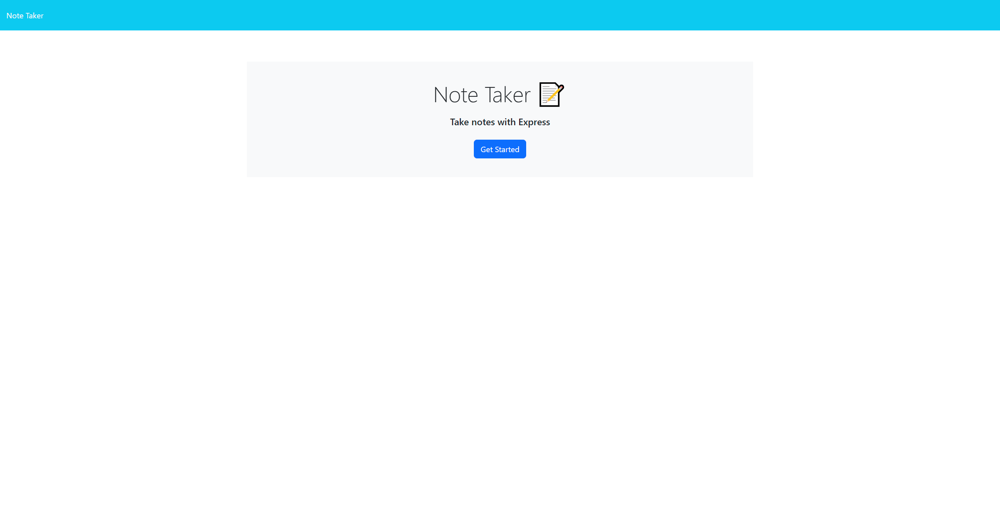

# Note Taker Starter Code

## Description

This is a simple note-taking application that is used to write and save notes. 


## Installation

1. Download or clone this repository
2. [node.js](https://nodejs.org/en) is required for this application.
3. Use the following command in the terminal to install the required packages:
```
npm i
```
4. Run the following command to start the application:
```
npm start
```


## Usage

Access the webpage using the deployed link [HERE](https://w11-note-taker-a4ba89ecc836.herokuapp.com/).

The link will open to the home page.

Click the `Get Started` button to open the main application.

Enter the title and description. To create the note, click the `save icon`.

Go through the notes or delete them in the side bar.


## Screenshot




## Credits

Special thanks to Xander, John and George for providing the [Starter Code](https://github.com/coding-boot-camp/miniature-eureka).


## License

Please refer to the LICENSE in the repo.

---
